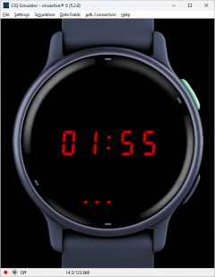
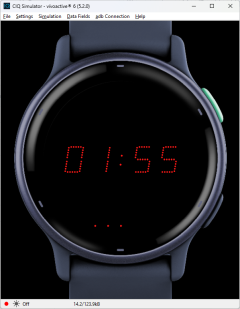

# ClassicLED

A simple Garmin watch face that mimics the look of classic 70s LED watches.

**Why this project exists**

- Just wanted a simple watch face.
- My first introduction to Garmin Connect IQ watch face development. 

**Key features**

- Three color/display modes (red, green, dot matrix) configurable via on-watch settings.
- Blinking colon (disabled in low-power/always-on display modes)
- Simple 5 dot battery indicator (disabled in low-power/always-on display modes)

**Getting started**

Prerequisites

- Garmin Connect IQ SDK
- Visual Studio Code and the Garmin Connect IQ / Monkey C extension.

**Known issues**

- When using the dotted digits mode, the display can be very dim when the watch adjusts for ambient light. Probably due to the tiny dots that make up the display. This issue is very noticeable on the Vivoactive 6.
- The dotted digits mode is also not usable in always-on display mode. Again, the display will be too dim.

License

- This project is covered by the repository `LICENSE` file. See [LICENSE](LICENSE).

Acknowledgements

- This project was based on [garmin-watchfaces](https://github.com/Gumix/garmin-watchfaces) which provided a great starting point.

